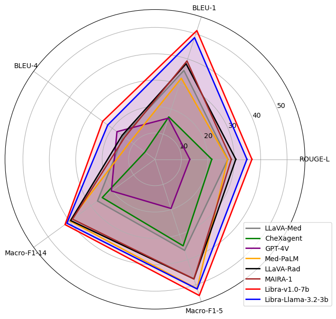

<h1 align="center">
  
  <strong>Libra: Leveraging Temporal Images for Biomedical Radiology Analysis</strong>
</h1>

<div align="center">

[](https://rexrank.ai/)
[](https://x-izhang.github.io/Libra_v1.0/)
[](https://deepwiki.com/X-iZhang/Libra)
[](https://huggingface.co/spaces/X-iZhang/Libra)
[](https://huggingface.co/collections/X-iZhang/libra-6772bfccc6079298a0fa5f8d)
[](https://arxiv.org/abs/2411.19378) 
[](https://star-history.com/#X-iZhang/Libra)
[](https://github.com/X-iZhang/Libra/blob/main/LICENSE)
[](https://visitorbadge.io/status?path=https%3A%2F%2Fgithub.com%2FX-iZhang%2FLibra)
</div>

*This repository hosts **Libra**, a tool designed to generate radiology reports by leveraging temporal information from chest X-rays taken at different time points.*

<details open><summary>📢 More Than Radiology: Codespace Features for MLLMs Workflow You’ll Love! 🎉 </summary><p>

>  * **Support for LLaVA-Type, LLaMA 3, Mistral, Phi-3/4 & Gemma**: Effortlessly run and fine-tune a variety of advanced open models.
>  * **Resume Training**: Resume training from checkpoints at any stage, whether for pre-training or fine-tuning.  
>  * **Validation Dataset**: Track model performance in real-time on `validation datasets` during training. 
>  * **Custom Metrics**: Go beyond `eval_loss` with metrics like `BLEU`, `ROUGE-L`, `RadGraph-F1` or define your own criteria on valid dataset.   
>  * **Smart Saving**: Automatically save the best model based on validation loss or custom evaluation scores.

</p></details>

## 🔥 News
- **[18 Jun 2025]** 🎤 Invited talk at [**HealTAC 2025**](https://healtac2025.github.io/programme/) — topic: [*Towards Temporal-Aware Multimodal Large Language Models for Improved Radiology Report Generation*](https://x-izhang.github.io/post/healtac2025/)
- **[16 May 2025]** 📝 A short blog: some musings on [***"What Does ‘Temporal’ Really Mean?”***](https://x-izhang.github.io/blog/libra-blog1/) — thoughts behind Libra and temporal reasoning in radiology.
- **[15 May 2025]** 🥳 [***The paper***](https://arxiv.org/pdf/2411.19378v2) has been accepted to [**ACL 2025**](https://2025.aclweb.org/)!
- **[09 May 2025]** ✨ Now with full support for the [Phi-4](https://huggingface.co/collections/microsoft/phi-4-677e9380e514feb5577a40e4) family — compact language and reasoning models from Microsoft.
- **[24 Mar 2025]** 🏆 **Libra** was invited to the [**ReXrank**](https://rexrank.ai/) Challenge — a leading leaderboard for Chest X-ray Report Generation.
- **[10 Mar 2025]**  ✅ The architecture of [LLaVA-Med v1.5](https://huggingface.co/microsoft/llava-med-v1.5-mistral-7b) is now supported by this repo. [**Compatible weights**](https://github.com/X-iZhang/Libra?tab=readme-ov-file#libra-v05) are provided, with 'unfreeze_mm_vision_tower: true' set to ensure the *adapted* vision encoder is used.
- **[11 Feb 2025]** 🚨 [**Libra-v1.0-3b**](https://huggingface.co/X-iZhang/libra-v1.0-3b) has been released! A **Small Multimodal Language Model for Radiology Report Generation**,  following the same training strategy as **Libra**.

<details>
<summary>- More -</summary>

- **[10 Feb 2025]** 🚀 The [**Libra**](https://github.com/X-iZhang/Libra) repo now supports [Mistral](https://huggingface.co/mistralai), [Phi-3](https://huggingface.co/collections/microsoft/phi-3-6626e15e9585a200d2d761e3), and [Gemma](https://huggingface.co/collections/google/gemma-2-release-667d6600fd5220e7b967f315) as LLMs, along with [SigLip](https://huggingface.co/collections/google/siglip-659d5e62f0ae1a57ae0e83ba) as the encoder!
- **[19 Jan 2025]** ⚡ The **online demo** is available at [Hugging Face Demo](https://huggingface.co/spaces/X-iZhang/Libra). Welcome to try it out!
- **[07 Jan 2025]** 🗂️ The processed data is available at [Data Download](https://github.com/X-iZhang/Libra#data-download).
- **[20 Dec 2024]** 🚨 [**Libra-v1.0-7b**](https://huggingface.co/X-iZhang/libra-v1.0-7b) has been released!

</details>


## Overview
Radiology report generation requires integrating temporal medical images and creating accurate reports. Traditional methods often overlook crucial temporal information. We introduce **Libra**, a temporal-aware MLLM for chest X-ray report generation. Libra combines a radiology-specific image encoder with a novel **`Temporal Alignment Connector (TAC)`**, designed to accurately capture and integrate temporal differences between paired current and prior images. Experiments show that Libra sets new performance benchmarks on the MIMIC-CXR dataset for the RRG task.

<details>
<summary>Libra’s Architecture</summary>


</details>

## Contents
- [Install](#install)
- [Model Weights](#model-weights)
    - [Libra-v1.0](#libra-v10)
    - [Libra-v0.5](#libra-v05)
    - [Projector weights](#projector-weights)
- [Quick Start](#quick-start)
    - [Gradio Web UI](#gradio-web-ui)
    - [CLI Inference](#cli-inference)
    - [Script Inference](#script-inference)
- [Dataset](#dataset)
    - [Prepare Data](#prepare-data)
    - [Preprocess Data](#preprocess-data)
    - [Data Download](#data-download)
- [Train](#train)
    - [Hyperparameters](#hyperparameters)
    - [Stage 1: visual feature alignment](#stage-1-visual-feature-alignment)
    - [Stage 2: RRG downstream task fine-tuning](#stage-2-rrg-downstream-task-fine-tuning)
    - [✨New Options to Note](#new-options-to-note)
- [Evaluation](#evaluation)
    - [Generate model responses](#1-generate-libra-responses)
    - [Evaluate the generated report](#2-evaluate-the-generated-report)
    - [Metrics](#metrics)

## Install
We strongly recommend that you create an environment from scratch as follows:
1. Clone this repository and navigate to Libra folder
```bash
git clone https://github.com/X-iZhang/Libra.git
cd Libra
```

2. Install Package
```Shell
conda create -n libra python=3.10 -y
conda activate libra
pip install --upgrade pip  # enable PEP 660 support
pip install -e .
```

3. Install additional packages for Training and Evaluation cases
```Shell
pip install -e ".[train,eval]"
pip install flash-attn --no-build-isolation
```

<details>
<summary> Upgrade to latest code base </summary>

```Shell
git pull
pip install -e .
```

</details>

## Model Weights

<p align="center">
   <br>
  Libra-v1.0 achieves SoTA performance.
</p>

### Libra-v1.0
| Version | Size | Projector | Base LLM | Vision Encoder| Checkpoint |
| ----------- | ----------- | ----------- | ----------- | ----------- | ----------- |
| Libra-1.0 | 7B | TAC | Meditron-7B | RAD-DINO | [libra-v1.0-7b](https://huggingface.co/X-iZhang/libra-v1.0-7b) |
| Libra-1.0 | 3B | TAC | Llama-3.2-3B-Instruct| RAD-DINO | [libra-v1.0-3b](https://huggingface.co/X-iZhang/libra-v1.0-3b) |


<details>
<summary> Performance on MIMIC-CXR (Findings section) </summary>

| Model | BLEU1 | BLEU4 | METEOR | ROUGE-L | RaTEScore | RG_ER |
|----------|----------|-----------|-----------|---|---|---|
| Libra-v1.0-7b | 51.3| 24.5 | 48.9 | 36.7 | 61.5 | 37.6 |
| Libra-v1.0-3b | 50.5 | 23.3 | 48.5 | 35.2 | 61.1 | 37.5 |

</details>

### Libra-v0.5

| Version | Size | Projector | Base LLM | Vision Encoder| Checkpoint |
| ----------- | ----------- | ----------- | ----------- | ----------- | ----------- |
| Libra-0.5 | 7B | MLP-2x | Vicuna-7B | CLIP-L-336px | [Med-CXRGen-F](https://huggingface.co/X-iZhang/Med-CXRGen-F) |
| Libra-0.5 | 7B | MLP-2x | Vicuna-7B | CLIP-L-336px | [Med-CXRGen-I](https://huggingface.co/X-iZhang/Med-CXRGen-I) |
| Llava-med | 7B | MLP-2x | Mistral-7B-Instruct-v0.2 | CLIP-L-336px (adapted) | [Llava-Med-v1.5](https://huggingface.co/X-iZhang/libra-llava-med-v1.5-mistral-7b) |

*💡Note: These two models are fine-tuned for `Findings` and `Impression` section generation. For more information on training strategies and dataset collection, please refer to [Med-CXRGen (Gla-AI4BioMed at RRG24)](https://github.com/X-iZhang/RRG-BioNLP-ACL2024)*

### Projector weights

These projector weights were pre-trained for visual instruction tuning on chest X-ray to text generation tasks. They can be directly used to initialise your model for multimodal fine-tuning in similar clinical domains.

⚠️ Important Note: For compatibility, please ensure that the *projector type*, *base LLM*, *conv_mode*, and *vision encoder* exactly match those used in our projector pretraining setup. Please also ensure the following settings are correctly configured during instruction tuning:

```Shell
--mm_projector_type TAC \ # or mlp2x_gelu
--mm_vision_select_layer all \ # or -2
--mm_vision_select_feature patch \
--mm_use_im_start_end False \
--mm_use_im_patch_token False \
```

| Base LLM | conv_mode | Vision Encoder | Projector | Pretrain Data | Download |
| ----------- | ----------- | ----------- | ----------- | ----------- | ----------- |
| Meditron-7B | libra_v1 | RAD-DINO | TAC | [RRG & VQA](https://physionet.org/content/mimic-cxr) | [projector](https://huggingface.co/X-iZhang/libra-v1.0-7b/resolve/main/mm_tac_projector.bin) |
| Llama-3.2-3B-Instruct | libra_llama_3 | RAD-DINO | TAC | [RRG & VQA](https://physionet.org/content/mimic-cxr) | [projector](https://huggingface.co/X-iZhang/libra-v1.0-3b/resolve/main/mm_tac_projector.bin) |
| Vicuna-7B| libra_v0 | CLIP-L-336px| MLP-2x | [Findings section](https://huggingface.co/datasets/StanfordAIMI/rrg24-shared-task-bionlp) | [projector](https://huggingface.co/X-iZhang/Med-CXRGen-F/resolve/main/mm_mlp2x_projector_findings.bin) |
| Vicuna-7B | libra_v0 | CLIP-L-336px | MLP-2x | [Impression section](https://huggingface.co/datasets/StanfordAIMI/rrg24-shared-task-bionlp) | [projector](https://huggingface.co/X-iZhang/Med-CXRGen-I/resolve/main/mm_mlp2x_projector_impressions.bin) |
| Mistral-7B-Instruct-v0.2| llava_med_v1.5_mistral_7b | CLIP-L-336px | MLP-2x | [LLaVA-Med Dataset](https://github.com/microsoft/LLaVA-Med?tab=readme-ov-file#llava-med-dataset) | [projector](https://huggingface.co/X-iZhang/libra-llava-med-v1.5-mistral-7b/resolve/main/mm_mlp2x_projector_llavamed.bin?download=true) |

## Quick Start

### Gradio Web UI

Launch a local or online web demo by running:

```bash
python -m libra.serve.app
```

<details>
<summary>Specify your model:</summary>

```bash
python -m libra.serve.app --model-path /path/to/your/model
```
</details>

You just launched the Gradio web interface. Now, you can open the web interface with the URL printed on the screen. You will notice that both the default `libra-v1.0` model and `your model` are available in the model list, and you can choose to switch between them.


### CLI Inference
We support running inference using the CLI. To use our model, run:
```Shell
python -m libra.serve.cli \
    --model-path X-iZhang/libra-v1.0-7b \
    --image-file "./path/to/current_image.jpg" "./path/to/previous_image.jpg"
    # If there is no previous image, only one path is needed.
```

### Script Inference
You can use the `libra_eval` function in `libra/eval/run_libra.py` to easily launch a model trained by yourself or us on local machine or in Google Colab, after installing this repository.

```Python
from libra.eval import libra_eval

# Define the model path, which can be a pre-trained model or your own fine-tuned model.
model_path = "X-iZhang/libra-v1.0-7b"  # Or your own model

# Define the paths to the images. The second image is optional for temporal comparisons.
image_files = [
    "./path/to/current/image.jpg", 
    "./path/to/previous/image.jpg"  # Optional: Only include if a reference image is available
]

# Define the prompt to guide the model's response. Add clinical instructions if needed.
prompt = (
    "Provide a detailed description of the findings in the radiology image. "
    "Following clinical context: ..."
)

# Specify the conversational mode, matching the PROMPT_VERSION used during training.
conv_mode = "libra_v1"

# Call the libra_eval function.
libra_eval(
    model_path=model_path,
    image_file=image_files,
    query=prompt,
    temperature=0.9,
    top_p=0.8,
    conv_mode=conv_mode,
    max_new_tokens=512
)
```
<details>
<summary>Meanwhile, you can use the Beam Search method to obtain output.</summary>

```Python
libra_eval(
    model_path=model_path,
    image_file=image_files,
    query=prompt,
    num_beams=5, 
    length_penalty=2,
    num_return_sequences=2,
    conv_mode=conv_mode,
    max_new_tokens=512
)
```

</details>

<details>
<summary>Additionally, you can directly use LoRA weights for inference.</summary>

```Python
libra_eval(
    model_path="./path/to/lora_weights",  # path to LoRA weights
    model_base="./path/to/base_model",  # path to base Libra model
    image_file=image_files,
    query=prompt,
    num_beams=5, 
    length_penalty=2,
    num_return_sequences=2,
    conv_mode=conv_mode,
    max_new_tokens=512
)
```

</details>

## Dataset

### Prepare Data

All the data we use comes from [MIMIC-CXR](https://physionet.org/content/mimic-cxr/2.0.0/) and its two variants, and we strictly follow the official split for `train/valid/test` division.

- Image Data

All images used for **Libra** come from the [MIMIC-CXR-JPG](https://physionet.org/content/mimic-cxr-jpg/2.0.0/) dataset in `.jpg` format. `DICOM` format is also supported and can be found in the [MIMIC-CXR](https://physionet.org/content/mimic-cxr/2.0.0/).

After downloading the images, they will be automatically organized into the following structure in `./path/to/playground/data`:

```
./data/physionet.org/files/mimic-cxr-jpg/2.0.0
└──files
    ├── p10
    │   └── p10000032
    │       └── s50414267
    │           ├── image1.jpg
    │           └── image2.jpg
    ├── p11
    ├── p12
    ├── ...
    └── p19
```

- Annotation Data

All annotations used for **Libra** come from the [MIMIC-CXR](https://physionet.org/content/mimic-cxr/2.0.0/) and its two variants. This includes Radiology Reports and other relevant Visual Question Answering. 

Please download the following datasets from the official website: `mimic-cxr-reports.zip` from [MIMIC-CXR](https://physionet.org/content/mimic-cxr/2.0.0/), [MIMIC-Diff-VQA](https://physionet.org/content/medical-diff-vqa/1.0.0/), and [MIMIC-Ext-*MIMIC-CXR-VQA*](https://physionet.org/content/mimic-ext-mimic-cxr-vqa/1.0.0/).

- Prior Image Retrieve

*💡Note: You can obtain metadata labels from [`mimic-cxr-2.0.0-metadata.csv.gz`](https://physionet.org/content/mimic-cxr-jpg/2.0.0/)*

<details>
<summary> Here, the train_split is used as an example for demonstration. </summary>

```python
from tqdm import tqdm
# Sort the test set by subject_id, StudyDate, and StudyTime to ensure chronological order
train_df_pair = train_df_pair.sort_values(by=['subject_id', 'StudyDate', 'StudyTime'])
train_df_pair = train_df_pair.reset_index(drop=True)

# Initialize a new column to store the prior image ID for each record
train_df_pair['prior_image'] = None

# Get the list of unique subject IDs (i.e., different patients)
unique_subject_ids = train_df_pair['subject_id'].unique()

# Use tqdm to create a progress bar while processing subjects
for subject_id in tqdm(unique_subject_ids, desc='Processing subjects'):
    # Extract all records for the current subject
    group = train_df_pair[train_df_pair['subject_id'] == subject_id]
    prior_image = None  # Initialize the prior image as None
    last_date = None    # Keep track of the previous study date

    # Iterate through each image for the current subject
    for idx, row in group.iterrows():
        # If the current study date is later than the last recorded date, update the prior image
        if last_date is None or row['StudyDate'] > last_date:
            train_df_pair.at[idx, 'prior_image'] = prior_image
            last_date = row['StudyDate']
        else:  # Records from the same study date
            # Find the first record on the same date for this subject
            # All records from the same day share the same prior image
            same_day_first = group[(group['StudyDate'] == row['StudyDate'])].index[0]
            train_df_pair.at[idx, 'prior_image'] = train_df_pair.at[same_day_first, 'prior_image']

        # Update the prior_image to be the current image for the next iteration
        prior_image = row['image']
```

</details>

### Preprocess Data

- Radiology Report Sections

For free-text radiology report, we extract the `Findings`, `Impression`, `Indication`, `History`, `Comparison`, and `Technique` sections using the official [mimic-cxr](https://github.com/MIT-LCP/mimic-cxr/tree/master/txt) repository.

*💡Note: To enable more structured and accurate extraction of the `Indication`, `History`, `Comparison`, and `Technique` sections—beyond what the original scripts provide—we replace the official ` .py` with our customised versions located in [`Libra/scripts/mimic-cxr/`](./scripts/mimic-cxr/).*


- Visual Question Answering for Chest X-ray

In [Medical-Diff-VQA](https://physionet.org/content/medical-diff-vqa/1.0.0/), the main image is used as the current image, and the reference image is used as the prior image. In [MIMIC-Ext-MIMIC-CXR-VQA](https://physionet.org/content/mimic-ext-mimic-cxr-vqa/1.0.0/), all cases use a dummy prior image.

### Data Download

| Alignment data files | Split | Size |
| ----- | ----- | -----: |
| [libra_alignment_train.json](https://drive.google.com/file/d/1AIT1b3eRXgJFp3FJmHci3haTunK1NTMA/view?usp=drive_link)| train | 780 MiB |
| [libra_alignment_valid.json](https://drive.google.com/file/d/1nvbUoDmw7j4HgXwZWiiACIhvZ6BvR2LX/view?usp=sharing)| valid | 79 MiB |

| Fine-Tuning data files | Split | Size |
| ----- | ----- | ----- |
| [libra_findings_section_train.json](https://drive.google.com/file/d/1rJ3G4uiHlzK_P6ZBUbAi-cDaWV-o6fcz/view?usp=sharing)| train | 159 MiB |
| [libra_findings_section_valid.json](https://drive.google.com/file/d/1IYwQS23veOU5SXWGYiTyq9VHUwkVESfD/view?usp=sharing)| valid | 79 MiB |

| Evaluation data files | Split | Size |
| --- | --- | ---: |
| [libra_findings_section_eval.jsonl](https://drive.google.com/file/d/1fy_WX616L8SgyAonadJ2fUIEaX0yrGrQ/view?usp=sharing)| eval | 2 MiB |


<details>

<summary>Meanwhile, here are some bonus evaluation data files.</summary>

| Evaluation data files | Split | Size |
| --- | --- | ---: |
| [libra_impressions_section_eval.jsonl](https://drive.google.com/file/d/16msRfk7XxCmq7ZPG82lKvsnnjqsRPv__/view?usp=sharing)| eval | 1 MiB |
| [libra_MIMIC-Ext-MIMIC-CXR-VQA_eval.jsonl](https://drive.google.com/file/d/1krPMwGGY6HP4sonNKlnkhLOoZrdjfVMW/view?usp=sharing)| eval | 4 MiB |
| [libra_MIMIC-Diff-VQA _eval.jsonl](https://drive.google.com/file/d/1tP_CxPMM9PiKTq1mLYRHICcyJ36Q13mC/view?usp=sharing)| eval | 20 MiB |

</details>


If you want to train or evaluate your own tasks or datasets, please refer to [`Custom_Data.md`](https://github.com/X-iZhang/Libra/blob/main/CUSTOM_DATA.md).


## Train
Libra adopt a two-stage training strategy: (1) visual feature alignment: the visual encoder and LLM weights are frozen, and the Temporal Alignment Connector is trained; (2) RRG downstream task fine-tuning: apply LoRA to fine-tune the pre-trained LLM on the Findings section generation task.

Libra is trained on 1 A6000 GPU with 48GB memory. To train on multiple GPUs, you can set the `per_device_train_batch_size` and the `gradient_accumulation_steps` accordingly. Always keep the global batch size the same: `per_device_train_batch_size` x `gradient_accumulation_steps` x `num_gpus`.

### Hyperparameters
We set reasonable hyperparameters based on our device. The hyperparameters used in both pretraining and LoRA finetuning are provided below.

1. Pretraining

| Hyperparameter | Global Batch Size | Learning rate | Epochs | Max length | Weight decay |
| --- | :---: | :---: | :---: | :---: | :---: |
| Libra-v1.0-7b | 16 | 2e-5 | 1 | 2048 | 0 |

2. LoRA finetuning

| Hyperparameter | Global Batch Size | Learning rate | Epochs | Max length | Weight decay | LoRA rank | LoRA alpha |
| --- | :---: | :---: | :---: | :---: | :---: | :---: | :---: |
| Libra-v1.0-7b | 16 | 2e-5 | 3 | 2048 | 0 | 128 | 256 |

### Download Meditron checkpoints (automatically)

Our base LLM model, [Meditron-7B](https://huggingface.co/epfl-llm/meditron-7b), adapted to the medical domain from the Llama-2-7B model, will be downloaded automatically when you run our provided training scripts. No action is needed on your part.

### Stage 1: visual feature alignment

Pretraining takes approximately 385 hours for Libra-v1.0-7b-pretrain on a single A6000 GPU (48GB) due to device limitations.

For detailed training scripts and guidelines, please refer to the following: [`pretrain.sh`](https://github.com/X-iZhang/Libra/blob/main/scripts/pretrain.sh) and [`pretrain_xformers.sh`](https://github.com/X-iZhang/Libra/blob/main/scripts/pretrain_xformers.sh) for [memory-efficient attention](https://arxiv.org/abs/2112.05682) implemented in [xFormers](https://github.com/facebookresearch/xformers).

- `--mm_projector_type TAC`: the Temporal Alignment Connector.
- `--vision_tower microsoft/rad-dino`: RAD-DINO is a vision transformer for encoding chest X-rays using DINOv2.
- `--mm_vision_select_layer all`: Use all image features from the encoder for the Layerwise Feature Extractor.
- `--tune_mm_mlp_adapter True`
- `--freeze_mm_mlp_adapter False` 

### Stage 2: RRG downstream task fine-tuning
You may download our pretrained projectors from the [`mm_tac_projector.bin`](https://huggingface.co/X-iZhang/libra-v1.0-7b) file. It takes around 213 hours for Libra-v1.0-7b on a single A6000 GPU (48GB) due to device limitations.

For detailed training scripts and guidelines, please refer to: [`finetune_lora.sh`](https://github.com/X-iZhang/Libra/blob/main/scripts/finetune_lora.sh).

- `--tune_mm_mlp_adapter False`
- `--freeze_mm_mlp_adapter True` 

If you have enough GPU memory: Use [`finetune.sh`](https://github.com/X-iZhang/Libra/blob/main/scripts/finetune.sh) to fine-tune the entire model. Alternatively, you can replace `zero3.json` with `zero3_offload.json` to offload some parameters to CPU RAM, though this will slow down the training speed.

If you are interested in continue finetuning Libra model to your own task/data, please check out [`Custom_Data.md`](https://github.com/X-iZhang/Libra/blob/main/CUSTOM_DATA.md).

### New Options to Note

- `--mm_projector_type TAC`: Specifies the Temporal Alignment Connector for Libra.
- `--vision_tower microsoft/rad-dino`: Uses RAD-DINO as the chest X-rays encoder.
- `--mm_vision_select_layer all`: Selects specific vision layers (e.g., -1, -2) or "all" for all layers.
- `--validation_data_path ./path/`: Path to the validation data.
- `--compute_metrics True`: Optionally computes metrics during validation. Note that this can consume significant memory. If GPU memory is insufficient, it is recommended to either disable this option or use a smaller validation dataset.


## Evaluation
In Libra-v1.0, we evaluate models on the MIMIC-CXR test split for the findings section generation task. You can download the evaluation data [here](https://drive.google.com/file/d/1fy_WX616L8SgyAonadJ2fUIEaX0yrGrQ/view?usp=sharing). To ensure reproducibility and output quality, we evaluate our model using the beam search strategy.

### 1. Generate Libra responses.

```Shell
python -m libra.eval.eval_vqa_libra \
    --model-path X-iZhang/libra-v1.0-7b \
    --question-file libra_findings_section_eval.jsonl \
    --image-folder ./physionet.org/files/mimic-cxr-jpg/2.0.0 \
    --answers-file /path/to/answer-file.jsonl \
    --num_beams 10 \
    --length_penalty 2 \
    --max_new_tokens 1024 \
    --conv-mode libra_v1
```

You can evaluate Libra on your custom datasets by converting your dataset to the [JSONL format](https://github.com/X-iZhang/Libra/blob/main/CUSTOM_DATA.md#evaluation-dataset-format) and evaluating using [`eval_vqa_libra.py`](https://github.com/X-iZhang/Libra/blob/main/libra/eval/eval_vqa_libra.py).

Additionally, you can execute the evaluation using the command line. For detailed instructions, see [`libra_eval.sh`](https://github.com/X-iZhang/Libra/blob/main/scripts/eval/libra_eval.sh).

```bash
bash ./scripts/eval/libra_eval.sh beam
```

### 2. Evaluate the generated report.

In our case, you can directly use `libra_findings_section_eval.jsonl` and `answer-file.jsonl` for basic evaluation, using [`radiology_report.py`](https://github.com/X-iZhang/Libra/blob/main/libra/eval/radiology_report.py).

```Python
from libra.eval import evaluate_report

references = "libra_findings_section_eval.jsonl"
predictions = "answer-file.jsonl"

resul = evaluate_report(references=references, predictions=predictions)

# Evaluation scores
resul
{'BLEU1': 51.25,
 'BLEU2': 37.48,
 'BLEU3': 29.56,
 'BLEU4': 24.54,
 'METEOR': 48.90,
 'ROUGE-L': 36.66,
 'Bert_score': 62.50,
 'Temporal_entity_score': 35.34}
```
Or use the command line to evaluate multiple references and store the results in a `.csv` file. For detailed instructions, see [`get_eval_scores.sh`](https://github.com/X-iZhang/Libra/blob/main/scripts/eval/get_eval_scores.sh).

```bash
bash ./scripts/eval/get_eval_scores.sh
```
### Metrics
- Temporal Entity F1

The $F1_{temp}$ score includes common radiology-related keywords associated with temporal changes. You can use [`temporal_f1.py`](https://github.com/X-iZhang/Libra/blob/main/libra/eval/temporal_f1.py) as follows:

```Python
from libra.eval import temporal_f1_score

predictions = [
    "The pleural effusion has progressively worsened since previous scan.",
    "The pleural effusion is noted again on the current scan."
]
references = [
    "Compare with prior scan, pleural effusion has worsened.",
    "Pleural effusion has worsened."
]

tem_f1_score = temporal_f1_score(
    predictions=predictions,
    references=references
)

# Temporal Entity F1 score
tem_f1_score
{'f1': 0.500000000075,
 'prediction_entities': [{'worsened'}, set()],
 'reference_entities': [{'worsened'}, {'worsened'}]}
```

- Radiology-specific Metrics

Some specific metrics may require configurations that could conflict with Libra. It is recommended to follow the official guidelines and use separate environments for evaluation: [`RG_ER`](https://pypi.org/project/radgraph/0.1.13/), [`CheXpert-F1`](https://pypi.org/project/f1chexbert/), [`RadGraph-F1, RadCliQ, CheXbert vector`](https://github.com/rajpurkarlab/CXR-Report-Metric).

<!--  -->

## Acknowledgements 🙏

We sincerely thank the following projects for their contributions to **Libra**:

* [LLaVA](https://github.com/haotian-liu/LLaVA): A Large Language and Vision Assistant, laying the groundwork for multimodal understanding.
* [FastChat](https://github.com/lm-sys/FastChat): An Open Platform for Training, Serving, and Evaluating Large Language Model based Chatbots.
* [LLaMA](https://github.com/facebookresearch/llama): Open and efficient foundation language models that inspired our core language processing capabilities.
* [MEDITRON](https://github.com/epfLLM/meditron): Open and efficient medical Large language models.
* [RAD-DINO](https://huggingface.co/microsoft/rad-dino): An open and efficient biomedical image encoder, enabling robust radiological analysis.

## Citation ✒️

If you find our paper and code useful in your research and applications, please cite using this BibTeX:
```BibTeX
@misc{zhang2025libraleveragingtemporalimages,
      title={Libra: Leveraging Temporal Images for Biomedical Radiology Analysis}, 
      author={Xi Zhang and Zaiqiao Meng and Jake Lever and Edmond S. L. Ho},
      year={2025},
      eprint={2411.19378},
      archivePrefix={arXiv},
      primaryClass={cs.CV},
      url={https://arxiv.org/abs/2411.19378}, 
}
```
## Intended Use 🧰

Libra is primarily designed to **assist** clinical practitioners, researchers, and medical students in generating chest X-ray reports. Key applications include:

- **Clinical Decision Support**: Providing draft findings that can be refined by a radiologist.  
- **Educational Tool**: Demonstrating example interpretations and temporal changes for training radiology residents.  
- **Research**: Facilitating studies on automated report generation and temporal feature learning in medical imaging.

> **Important**: Outputs should be reviewed by qualified radiologists or medical professionals before final clinical decisions are made.

<details>
<summary>Limitations and Recommendations</summary>

1. **Data Bias**: The model’s performance may be less reliable for underrepresented demographics or rare pathologies.  
2. **Clinical Oversight**: Always involve a medical professional to verify the results—Libra is not a substitute for professional judgment.  
3. **Temporal Inaccuracies**: Despite TAC’s focus on temporal alignment, subtle or uncommon changes may go unrecognized.  
4. **Generalization**: Libra’s performance on chest X-ray types or conditions not seen during training may be limited.
</details>

<details>
<summary>Ethical Considerations</summary>

- **Patient Privacy**: Ensure the data is fully de-identified and compliant with HIPAA/GDPR (or relevant privacy regulations).  
- **Responsible Use**: Deploy Libra’s outputs carefully; they are not guaranteed to be error-free.  
- **Accountability**: Users and organizations must assume responsibility for verifying clinical accuracy and safety.
</details>

<details>
<summary>Disclaimer</summary>

This tool is for research and educational purposes only. It is not FDA-approved or CE-marked for clinical use. Users should consult qualified healthcare professionals for any clinical decisions.
</details>
